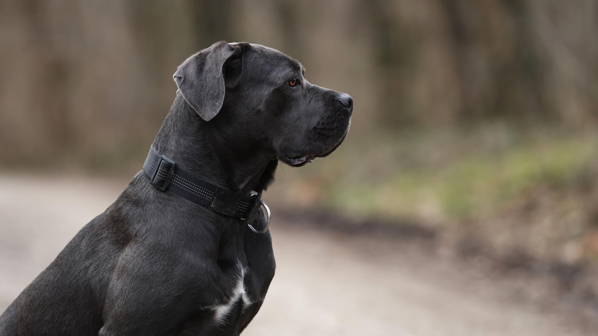

# Чи можуть собаки відчувати зло? Факти та інформація

**Автор: Шантель Фаулер**  
Оновлено: 28 липня 2025 року

## Зміст
- [Чи можуть собаки відчувати злість?](#чи-можуть-собаки-відчувати-злість)
- [Як собаки відчувають енергію?](#як-собаки-відчувають-енергію)
- [Що говорить наука?](#що-говорить-наука)
- [Висновки](#висновки)

---

## Чи можуть собаки відчувати злість?

Не існує простого й однозначного пояснення, чи можуть собаки відчувати зло, адже “зло” — це дуже складне і багатозначне поняття. Словникове визначення зла — це “глибоко аморальна та зла поведінка”, і подібні форми поведінки зустрічаються навіть у тваринному світі.

Ми також знаємо, що собаки мають надзвичайні сенсорні здібності та чудову здатність відчувати людські емоції. Ці навички впливають на те, як собаки реагують на людей або ситуації, які вони можуть вважати шкідливими, негативними чи загрозливими.

---

## Як собаки відчувають енергію?

У собак дуже гострі органи чуття, завдяки яким вони помічають навіть найменші зміни в середовищі та поведінці людей.

Завдяки підвищеній здатності **бачити, чути, відчувати та нюхати**, вони можуть визначати:

- емоції,
- фізіологічні зміни,
- хвороби,
- зміни навколишнього середовища.

Коли людина відчуває емоції — сум, тривогу, злість — у тілі відбуваються фізіологічні реакції. Ми рухаємося, говоримо, пахнемо й поводимося по-іншому. Собаки здатні легко зчитувати ці сигнали.

Наприклад:

- Коли ви повертаєтеся додому в чудовому настрої, посміхаєтесь і радісно вітаєте свого пса — він одразу розуміє, що ви щасливі.
- Якщо ваш день був жахливим, ваша хода, міміка та енергія будуть зовсім іншими — і собака це відчує миттєво.

---

## Що говорить наука?

Є наукові дослідження, що показують: собаки мають набагато більш розвинуте соціальне сприйняття, ніж вважалося.

### 🔹 Собаки відчувають людський стрес

Дослідження показали, що собаки можуть розпізнавати психологічний стрес у людей. Більше того, існує явище **синхронізації стресу** — коли собака дзеркально повторює рівень стресу свого власника.

### 🔹 Собаки можуть оцінювати поведінку людини

Дослідження 2016 року показало, що собаки здатні визначати, коли люди поводяться грубо або нечемно по відношенню до інших людей.

**Суть експерименту:**

1. Власники собак намагалися відкрити контейнер — навмисно безуспішно.  
2. Один дослідник допомагав власнику.  
3. Другий або пасивно стояв поруч, або відмовлявся допомагати.  
4. Після цього обидва пропонували собаці ласощі.

**Результати:**

- Якщо один допомагав, а інший просто стояв — собаки приймали ласощі від обох.
- Якщо один відкрито відмовлявся допомогти — собаки ігнорували його та йшли до пасивного дослідника.

**Висновок:**  
Собаки не довіряють людям, які поводяться погано. Вони здатні оцінювати характер людини за її поведінкою.

---

## Висновки

Собаки, ймовірно, **не можуть відчувати "зло" у надприродному сенсі**. Але їхні фізіологічні та сенсорні здібності дозволяють їм:

- точно зчитувати людські емоції,
- відчувати фізіологічні зміни (включно з ознаками агресії або злості),
- оцінювати поведінку людей і робити висновки про їхню “доброту” чи “недобрість”.

Тож хоча собаки й не “бачать зло”, як у фільмах, вони чудово вміють визначати, хто викликає довіру, а хто — ні.

