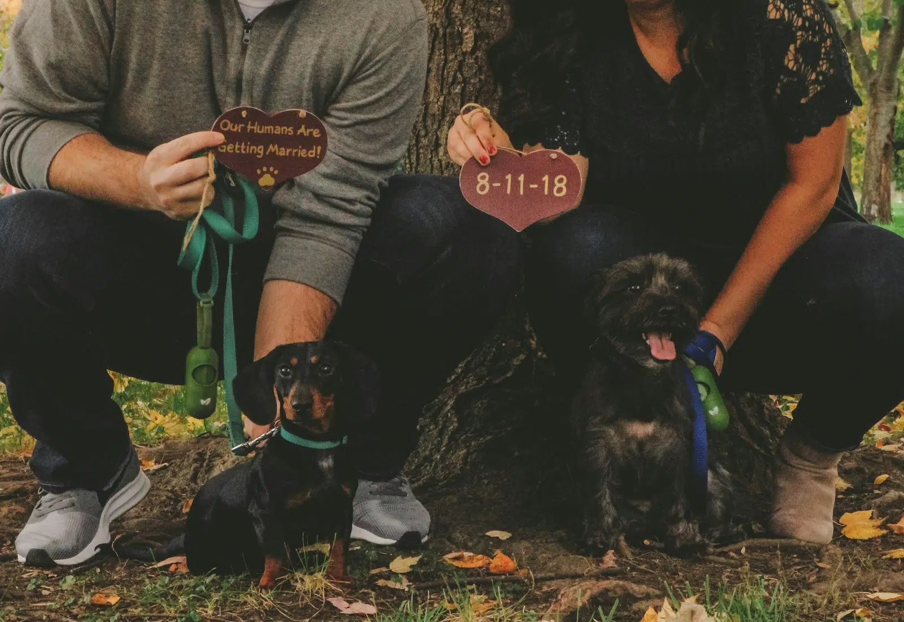
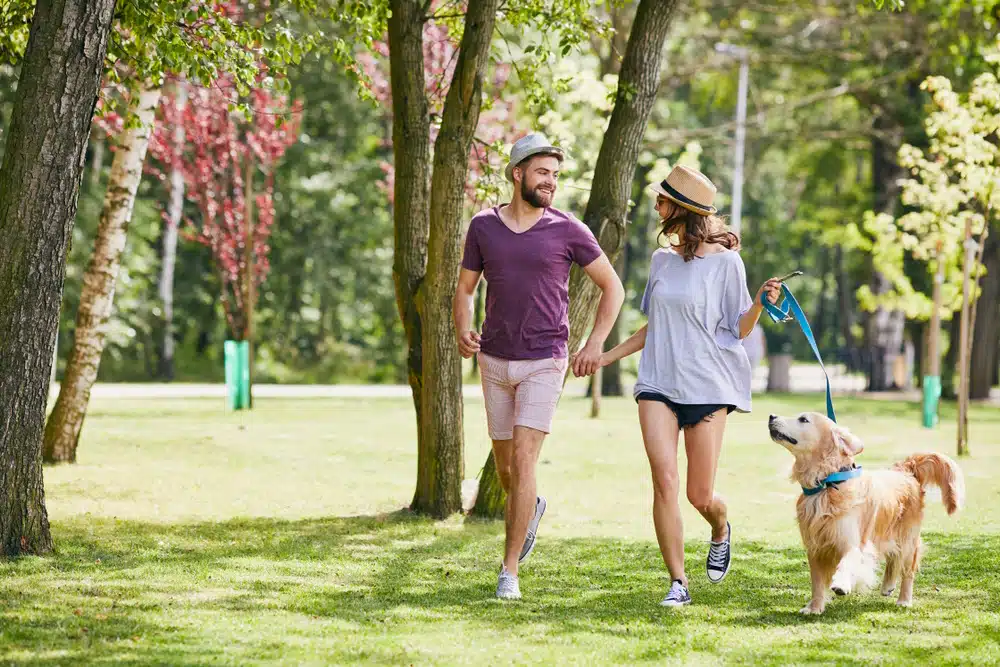

# 10 порад для фотосесії заручин із вашим собакою (2025)

**Автор: Джессіка Кім**  
Оновлено: 28 липня 2025 року

Фотосесії заручин — це чудова можливість зберегти моменти радості та передвесільного хвилювання. Включення вашого собаки у фотосесію — відмінний спосіб залучити тих, кого ви любите, та зібрати красиві моменти разом.

Звісно, участь собаки у фотосесії має свої унікальні виклики. Нижче наведені поради, які допоможуть підготуватися та надихнуть на цікаві ідеї для вашої фотосесії з собакою.

---

## 10 порад для фотосесії заручин із вашим собакою

### 1. Спілкуйтеся з вашим фотографом
Для успішної фотосесії потрібно ретельно планувати та координувати дії. Повідомте вашого фотографа завчасно, що хочете включити вашого собаку у фотосесію.

Навіть наймиліший собака може стати непередбачуваним для фотографа. Багато локацій та популярних місць для фотосесій не допускають тварин. Чітке спілкування з фотографом гарантує наявність необхідного обладнання та вибір дружніх для собак локацій.

---

### 2. Приходьте підготовленими з ласощами та необхідними речами
Візьміть окрему сумку для собаки: поводок, улюблені ласощі, іграшки, пакети для прибирання. Також корисно взяти серветки для лап або рушник на випадок, якщо собака забрудниться.

Якщо собака носитиме одяг або аксесуари вперше, він може відчувати дискомфорт. Тож заздалегідь привчіть його до одягу, щоб він почувався комфортно під час фотосесії.

---

### 3. Одягайте зручний одяг
Для активних або енергійних собак краще обирати більш повсякденний одяг. Залиште святковий одяг для фотосесії лише з партнером, а для фотосесії з собакою оберіть зручні речі, щоб можна було робити активні кадри.

---

### 4. Робіть затишні фото вдома
Якщо ваш собака сором’язливий або легко відволікається, домашня фотосесія — хороший варіант. Дім — найзвичніше середовище для собаки, він почуватиметься спокійніше, а отримати увагу собаки буде легше.

---

### 5. Вийдіть на прогулянку
Прогулянки допомагають собакам розслабитися та виплеснути накопичену енергію. Під час прогулянки собака виглядає щасливішим, і фотограф зможе зробити гарні кадри вас і вашого партнера з собакою.

---

### 6. Досліджуйте свій район
Прогулянки по вашому районі — цікава концепція для фотосесії. Оберіть локації, де можна зупинятися для фото. Зважайте на розмір і колір шерсті собаки, щоб він не зливався з фоном.

---

### 7. Відтворіть перше побачення з вашим собакою

Спробуйте відтворити перше побачення чи момент, який ви провели з партнером разом із собакою. Якщо це неможливо, подумайте про інші місця, які ви відвідували з собакою, щоб мати більше варіантів для фотосесії.

---

### 8. Фото на природі
Природні локації добре підходять для фотосесії. Собаки чудово вписуються у природний фон і зазвичай виглядають щасливими. Переконайтеся, що щеплення собаки актуальні, і він отримав профілактичні засоби від паразитів.

---

### 9. Не ігноруйте "природні" кадри 
Неформальні кадри допомагають показати справжню особистість вашого собаки. Якщо собака не хоче сидіти або відчуває дискомфорт, дайте йому робити те, що він хоче, а фотограф може зловити ці моменти.

---

### 10. Попросіть друга приглянути за собакою
Додаткова допомога під час фотосесії дуже корисна. Друг або член сім’ї може відволікати собаку, виводити на прогулянку та допомагати фотографу привернути увагу собаки до камери.

---

## Висновок
Фотосесія з собакою вимагає додаткових зусиль та планування, але це абсолютно можливо. Повідомте фотографа завчасно та врахуйте комфорт вашого собаки. Використовуйте сильні сторони собаки, і ви отримаєте природні та милі кадри, які відобразять вашу заручинну історію разом із собакою.
